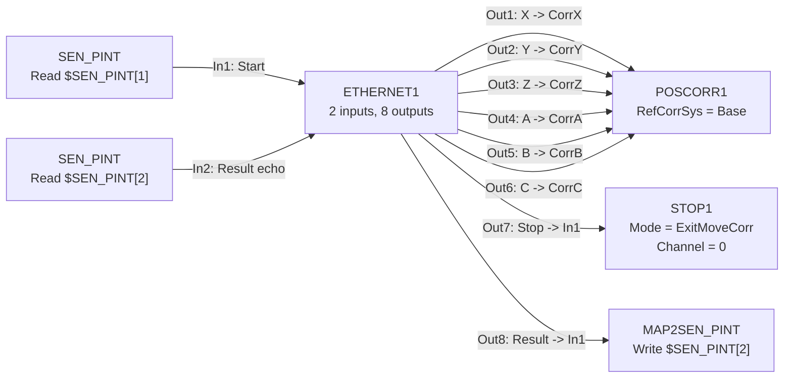

# RSI_Hole minimal experiment

ETHERNET1 ConfigFile: `RSI_Hole_EthernetConfig.xml`.

`Start` is the existing KRL execution request: 0 before entry, 1 immediately
before `RSI_MOVECORR`. `Result` is 0 during execution and 1 for normal completion.
For an unsuccessful stop it remains 0, so the existing KRL completion check
prevents the return to Ps/HOME.

At normal completion the PC sends zero corrections with `Result=1, Stop=0`.
After the controller echoes `Result=1`, it sends zero corrections with
`Result=1, Stop=1`. The result echo confirms the KRL flag was written before Stop.
